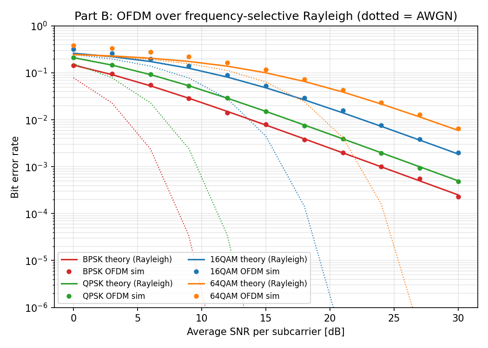
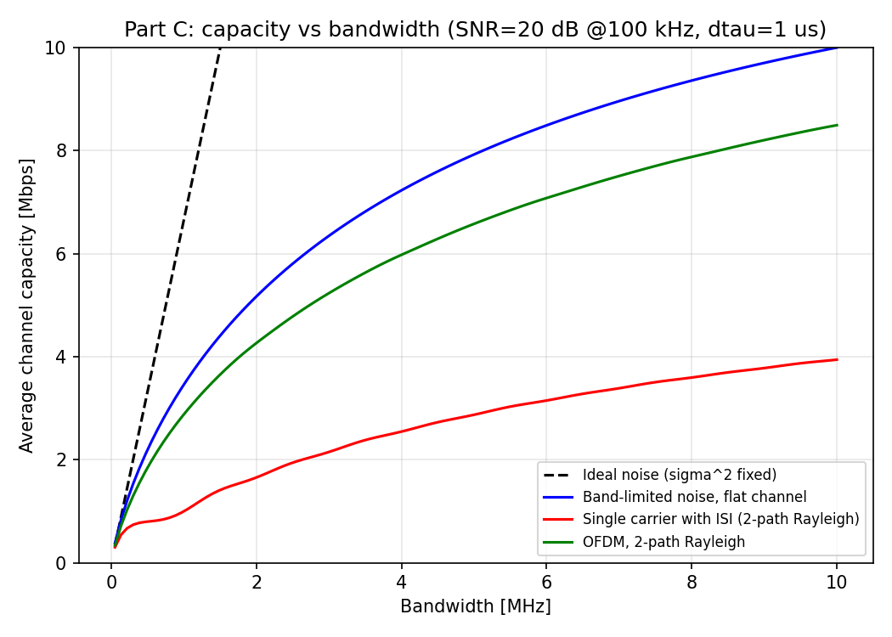
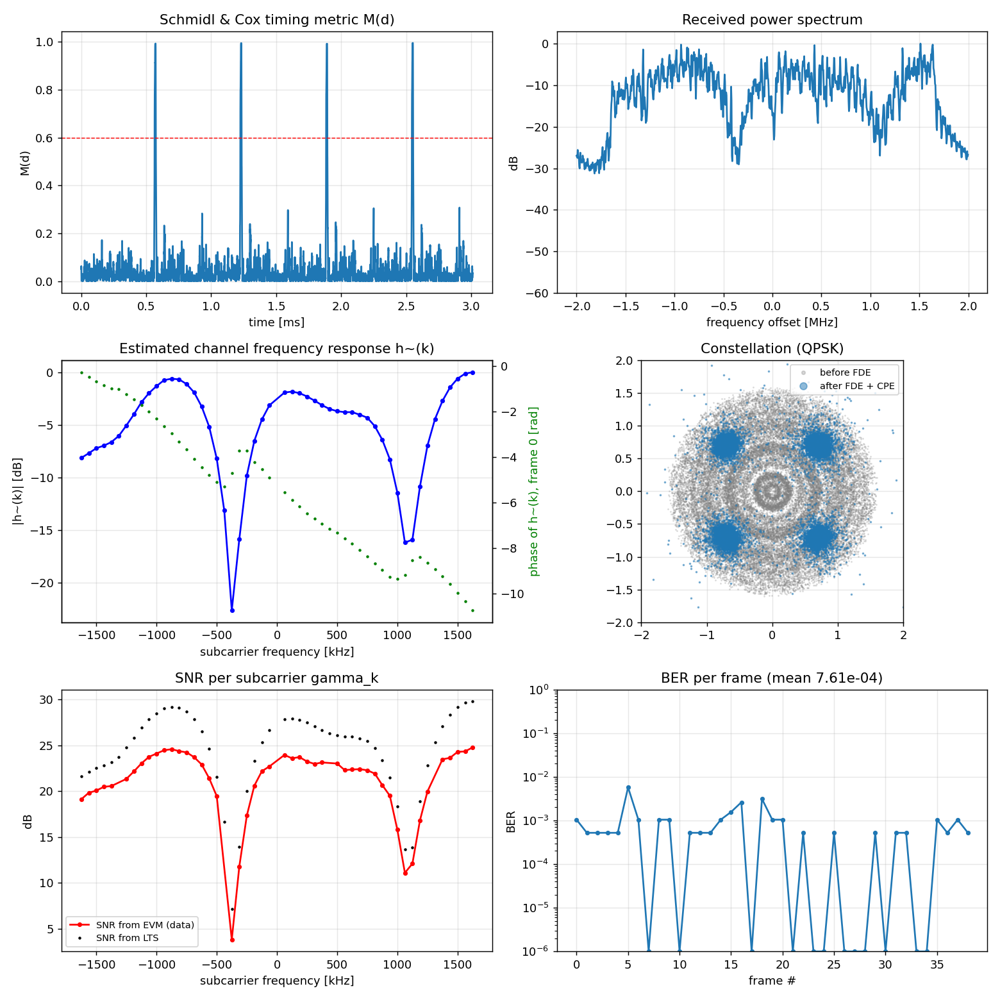

# OFDM-ийг HackRF Pro ашиглан хэрэгжүүлэх — лабораторийн ажил

**Implementing OFDM with two HackRF Pro SDRs — a two-session lab for Wireless Communication Engineering II (Lecture 3: OFDM for Wireless Broadband)**

> *English summary:* GNU Radio 3.10 flowgraphs and Python scripts that take students from the theory of OFDM (IFFT/FFT, cyclic prefix, frequency-domain equalisation, per-subcarrier SNR and capacity) to a working over-the-air OFDM link between two HackRF Pro radios. The student guide (`docs/`) is written in Mongolian; technical terms are kept in English.

Энэ repository нь Утасгүй холбооны инженерчлэл II хичээлийн Лекц 3 (OFDM for Wireless Broadband)-д зориулсан лабораторийн ажлын бүх материалыг агуулна. Оюутнууд эхлээд симуляцаар OFDM-ийн үндсийг судалж, дараа нь хоёр HackRF Pro ашиглан бодит радио сувгаар OFDM дамжуулалт хийнэ.

📄 **Оюутны гарын авлага:** [`docs/OFDM_HackRF_Pro_Lab_Guide.pdf`](docs/OFDM_HackRF_Pro_Lab_Guide.pdf) (засварлах хувилбар: [`.docx`](docs/OFDM_HackRF_Pro_Lab_Guide.docx))

## Агуулга

| Хичээл | Дасгал | Файл | Агуулга |
|---|---|---|---|
| 1 — Симуляц | 1 | `lab/lab1_ofdm_basics.grc` | IFFT/FFT, cyclic prefix, subcarrier-уудын sinc² спектр, CFO-оос үүсэх ICI |
| | 2 | `lab/lab2_multipath_cp_fde.grc` | Multipath суваг, ISI, CP-ийн урт, Zero-Forcing FDE, \|h̃(k)\|² |
| | 3 | `lab/ofdm_sim.py` | Single carrier ISI vs OFDM, Rayleigh сувагт BER, bandwidth-ээс хамаарах capacity |
| 2 — HackRF Pro | 4 | `lab/lab4_ofdm_packets_sim.grc`<br>`lab/lab4_hackrf_ofdm_tx.grc`<br>`lab/lab4_hackrf_ofdm_rx.grc`<br>`lab/lab4_per.py` | GNU Radio OFDM Transmitter/Receiver-ээр packet дамжуулж PER хэмжих |
| | 5 | `lab/ofdm_lab5.py`<br>`lab/lab5_hackrf_iq_tx.grc`<br>`lab/lab5_hackrf_iq_rx.grc` | Өөрийн OFDM frame, offline receiver: Schmidl & Cox sync, CFO, channel estimation, FDE, subcarrier бүрийн SNR, BER, capacity |

## Шаардлага

- 2 × HackRF Pro (эсвэл HackRF One), антенн эсвэл SMA кабель + 30–40 dB attenuator
- GNU Radio 3.10, SoapySDR + SoapyHackRF (`soapysdr-module-hackrf`)
- Python 3: `pip install -r requirements.txt`

```bash
sudo apt install gnuradio hackrf soapysdr-tools soapysdr-module-hackrf
hackrf_info                              # хоёр HackRF Pro харагдах ёстой
SoapySDRUtil --find="driver=hackrf"
```

## Хурдан эхлэх

```bash
cd lab

# Хичээл 1 — симуляц
gnuradio-companion lab1_ofdm_basics.grc
gnuradio-companion lab2_multipath_cp_fde.grc
python3 ofdm_sim.py                       # → results/*.png

# Хичээл 2 — Дасгал 5-ыг hardware-гүйгээр турших
python3 ofdm_lab5.py gen --mod qpsk --fs 4e6
python3 ofdm_lab5.py sim --snr 25 --cfo 4000 --taps "1,0,0,0.6j,0,0.3"
python3 ofdm_lab5.py rx                   # → results/rx_report.png

# Хичээл 2 — HackRF Pro
gnuradio-companion lab5_hackrf_iq_tx.grc  # PC-A, HackRF #1
gnuradio-companion lab5_hackrf_iq_rx.grc  # PC-B, HackRF #2 → rx_capture.cfile
python3 ofdm_lab5.py rx --file rx_capture.cfile --fc 2.45e9
```

Flowgraph болон Python файлуудыг нэг хавтсанд (`lab/`) байлгана. Скриптүүд `ofdm_tx_frames.cfile`, `rx_capture.cfile` зэрэг файлыг тухайн хавтаснаас уншиж, бичдэг.

## Жишээ үр дүн

| Дасгал 3 — Rayleigh сувагт OFDM-ийн BER | Дасгал 3 — Capacity ба bandwidth |
|---|---|
|  |  |

Дасгал 5-ын offline receiver-ийн гаралт (симуляц: SNR = 25 dB, CFO = 4 kHz, h = [1, 0, 0, 0.6j, 0, 0.3]):



## ⚠️ Аюулгүй ажиллагаа ба радио давтамж

- Хоёр HackRF-ийг кабелиар шууд холбохдоо **заавал 30–40 dB attenuator** ашиглана. TX VGA-г 0 dB-ээс эхлүүлж, RF amplifier-ийг (`amp`) асаахгүй.
- Анхдагч давтамж нь 433.92 MHz (Дасгал 4) ба 2.45 GHz (Дасгал 5). Зөвхөн танай улс, байгууллагад зөвшөөрөгдсөн давтамж дээр, хамгийн бага чадлаар дамжуулна.
- Энэ материалыг ашигласнаас үүсэх радио саатал, тоног төхөөрөмжийн гэмтлийн хариуцлагыг хэрэглэгч өөрөө хүлээнэ.

## Тэмдэглэл

- Flowgraph-уудыг GNU Radio 3.10.9 дээр compile хийж, симуляцын хэсгийг туршсан. HackRF Pro-той ажиллах flowgraph-уудыг хичээлийн өмнө өөрийн тоног төхөөрөмж дээр нэг удаа туршиж үзэхийг зөвлөж байна.
- Лабораторийн агуулга нь Kei Sakaguchi-ийн “Wireless Communication Engineering II, #3: OFDM of Wireless Broadband” лекцийн материалд тулгуурласан. Лекцийн слайд энэ repository-д ороогүй.

## License

- Код (`lab/*.py`, `lab/*.grc`): [MIT License](../LICENSE)
- Гарын авлага ба зураг (`docs/`, `images/`): [CC BY 4.0](docs/LICENSE.md)

Ашиглахдаа эх сурвалжийг дурдана уу: *Adiyabat Enkhjargal, National University of Mongolia — OFDM with HackRF Pro lab (2026).*
